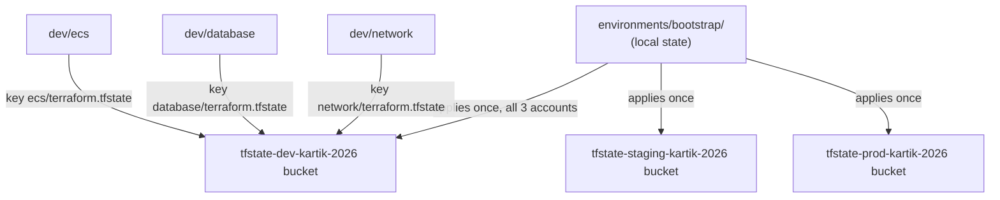
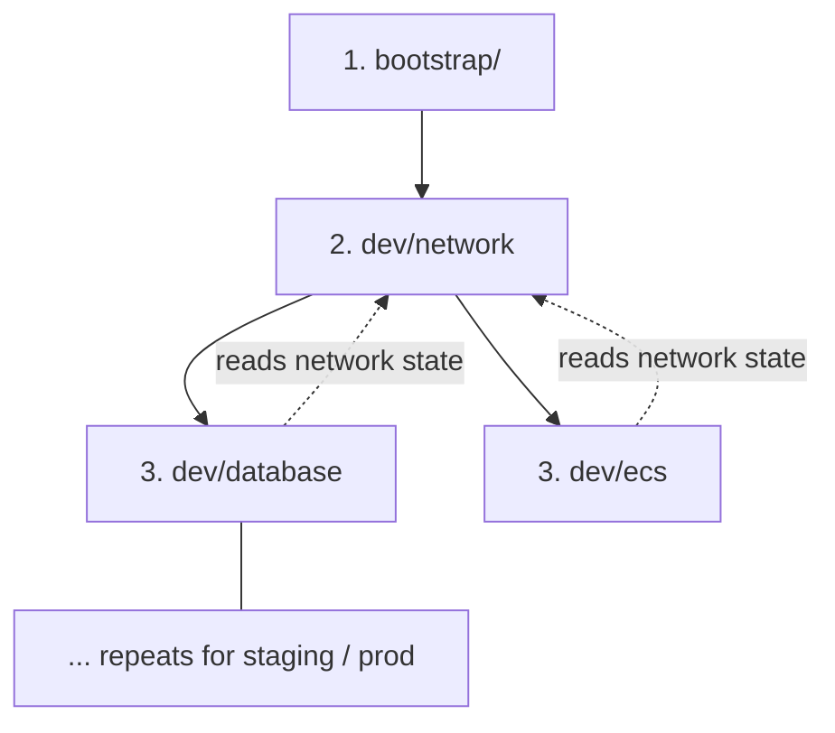
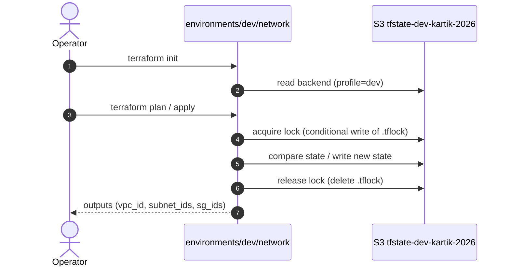

# Terraform Repository Architecture

> **Scope of this document.** This describes the **Terraform codebase
> architecture**: how the repository is laid out, how workspaces are organised,
> how state is managed, and how environments are executed and controlled. It is
> deliberately **not** about the AWS infrastructure (VPC, RDS, ECS resources).
> For the infra resources and the live-demo narrative, see
> `docs/DEMO-SCRIPT.md`; for credentials/cost, `docs/SETUP.md`.

The repository is the **Act 1** half of a two-act demo. Act 1 operates a
multi-account, multi-environment setup with **pure Terraform** while
deliberately surfacing Terraform's friction in this scenario. Act 2 (deferred)
re-expresses the same layout with Terragrunt; the layout below is shaped so the
mirror is a 1:1 replacement of the thin roots only.

---

## 1. Design principles

The whole structure follows five rules. Everything below is a consequence.

1. **Environment-centric layout.** The top of the tree is
   `environments/{env}/`, not `components/{env}/`. An operator thinks "I am
   working on **dev**", and every component of dev lives under one parent.
2. **Thin roots over shared modules.** `environments/*/` contains only thin
   calling code (a provider + a module call + local values). All real
   resources live in reusable modules at `modules/`, on the repo root — shared
   by *both* acts, untouched by Act 2.
3. **One workspace = one directory = one state file.** There is no
   aggregation and no state sharing *within* a workspace. Coupling between
   workspaces is done explicitly, out-of-band, via
   `terraform_remote_state`.
4. **Environments are coded identically, configured differently.** The
   code files of `dev`, `staging`, and `prod` are byte-identical; only the
   backend identity and the per-environment values differ. This is the
   concrete "copy the folder, change the values" promotion story the demo
   shows — and the boilerplate that Terragrunt later deletes.

---

## 2. Repository layout

```
terraform-101/
├── README.md
├── Makefile                        # fmt / validate / plan / destroy
├── scripts/
│   ├── validate-all.sh             # fmt + init -backend=false + validate, 3 envs × 3 comps
│   ├── plan-all.sh                 # init + plan (needs credentials)
│   └── destroy-all.sh              # destroy in reverse order (ecs → database → network)
├── docs/                           # SETUP, DEMO-SCRIPT, GAPS, this file
│   └── superpowers/                # design spec + implementation plan (versioned)
│
├── modules/                        # ══ REUSABLE LAYER (shared, infra-agnostic) ══
│   ├── state/                      #   S3 state bucket (S3-native lockfile inside it)
│   ├── network/                    #   VPC, subnets, IGW, NAT+EIP, route tables, 3 SGs
│   ├── database/                   #   RDS PostgreSQL + subnet group
│   └── ecs/                        #   ECS cluster, Fargate service, task def, ALB, IAM
│
└── environments/                   # ══ ROOT/ACT 1 LAYER — one folder per workspace ══
    ├── bootstrap/                  #   ⚠ local state: creates the state buckets for all 3 accounts
    ├── dev/                        #   ── 1st-level split: the environment ──
    │   ├── network/                #     ── 2nd-level split: the component ──
    │   ├── database/
    │   └── ecs/
    ├── staging/                    #   (identical file set, different backend + tfvars)
    └── prod/                       #   (identical file set, hardened tfvars)
```

Every leaf `environments/{env}/{component}/` is its own Terraform *workspace*
(in the pre-1.5 "separate directory" sense): its own `backend`, its own state
file, its own provider configuration. There are **1 (bootstrap) + 3 × 3 = 10
workspaces**; each can be planned/applied/destroyed independently, in order.

---

## 3. The module layer (`modules/`)

Modules live at the **repo root**, outside `environments/`, so they are not
bound to any environment and Act 2 reuses them unchanged. Each module is
self-contained: it declares its own `variables.tf` inputs and `outputs.tf`
outputs and never references another module. Cross-module wiring happens only
in the root layer via `terraform_remote_state` (section 6).

| Module | Purpose | Key inputs | Outputs |
|---|---|---|---|
| `state` | Per-account S3 state bucket (S3-native lockfile lives in the same bucket) | `bucket_name`, `region`, `tags` | `bucket_name` |
| `network` | VPC, 3 public + 3 private subnets, IGW, NAT+EIP, route tables, `alb`/`ecs`/`db` SGs | `env_name`, `region`, `vpc_cidr`, `azs`, `public/private_subnet_cidrs`, `nat_gateway_count`, `tags` | `vpc_id`, `vpc_cidr_block`, `public_subnet_ids`, `private_subnet_ids`, `alb_sg_id`, `ecs_sg_id`, `db_sg_id` |
| `database` | RDS PostgreSQL + subnet group, managed password | `env`, `db_name`, `instance_class`, `allocated_storage`, `backup_retention_period`, `multi_az`, `deletion_protection`, `skip_final_snapshot`, `subnet_ids`, `db_sg_id`, `tags` | `db_endpoint`, `db_name`, `db_port`, `db_sg_id` |
| `ecs` | ECS cluster, Fargate service, task def, ALB + listener, IAM roles | `env`, `region`, `image`, `cpu`, `memory`, `desired_count`, `vpc_id`, `public_subnet_ids`, `private_subnet_ids`, `alb_sg_id`, `ecs_sg_id`, `tags` | `cluster_name`, `service_name`, `alb_dns_name` |

Design note: `modules/state` is **bootstrap-only** — it is called from the
`bootstrap` workspace, never from an environment. Everything else is called
from the environment components. The modules are intentionally provider-version
agnostic at the interface level; version pins live in each workspace's
`versions.tf`.

---

## 4. The component layer (a workspace's anatomy)

Each `environments/{env}/{component}/` holds the same source files (plus a
committed provider lock file). This is the unit of repeatable boilerplate the
demo is about.

| File | Role |
|---|---|
| `providers.tf` | `provider "aws"` (region + profile from vars). |
| `main.tf` | One `module` call. `database`/`ecs` additionally hold a `data "terraform_remote_state"` to pull `network` outputs. |
| `backend.tf` | **Static, hand-written** `backend "s3"` — bucket, key, region, profile, `use_lockfile`, encryption. Values are literal, never derived. |
| `variables.tf` | Thin pass-through of the module's inputs, each with `description` + `type`. |
| `terraform.tfvars` | The actual per-environment values (profile, env_name, CIDRs, DB class, hardening flags). |
| `outputs.tf` | Re-exposes the module's outputs at the workspace level (DB outputs marked `sensitive`). |
| `terraform.tf` | `required_version ~> 1.11` + AWS provider `~> 5.0`. |
| `.terraform.lock.hcl` | Provider dependency lock (committed, per convention). |

### Which files are environment-specific?

| File | `dev` vs `staging` vs `prod` |
|---|---|
| `main.tf` | **identical** (byte-for-byte) |
| `providers.tf` | **identical** |
| `variables.tf` | **identical** |
| `outputs.tf` | **identical** |
| `terraform.tf` | **identical** |
| `backend.tf` | **differs**: bucket `tfstate-<env>-kartik-2026`, `profile = <env>` |
| `terraform.tfvars` | **differs**: profile, CIDR, database hardening |

This split is the core of the "static, repeated, hand-edited" story: the
*logic* of each component is one copy reused everywhere, while the *state
pointer* and *values* are per-environment hand-written files — exactly what
Terragrunt's `generate` + `remote_state` later synthesize.

> **Note (2026-08):** file names follow the current HashiCorp style guide —
> `providers.tf` for provider blocks, `terraform.tf` for version pins. Only
> `backend.tf` and `terraform.tfvars` differ per environment.

---

## 5. State management

State is per-account **and** per-component, giving 9 state files (3 envs × 3
components) plus a bootstrap-local state.

### The state flow



Locking is S3-native: alongside each state object the bucket holds a matching
`<key>.tflock` object (see conventions below). No DynamoDB.

### Conventions

- **Bucket** `tfstate-<env>-kartik-2026` — one bucket per environment (thus per account).
  Environment isolation is *bucket-level*.
- **Key** `<component>/terraform.tfstate` — **no env prefix** inside the key.
  The bucket already isolates environments; the key only separates the three
  components of that environment.
- **Lock** — S3-native (`use_lockfile = true`, Terraform ≥ 1.11). Acquiring
  the lock is a conditional write (`If-None-Match: *`) of a `<key>.tflock`
  object in the same bucket; it succeeds only while the object does not exist,
  so two operators cannot plan/apply the same component state concurrently
  (a second attempt fails with `412 Precondition Failed`). The lock is
  released by deleting the object.
- **Encryption** — SSE-AES256, TLS-only bucket policy, public access blocked.

### The bootstrap chicken-and-egg

The S3 backend that every component needs is itself created by Terraform in
`environments/bootstrap/`. That workspace has **no `backend.tf`** — its state
is local — so it can run before any bucket exists. Nothing else can
`terraform init` until bootstrap has run. This dependency is the demo's
teaching point for "state must exist before Terraform can operate."

### Credential resolution

Every `backend.tf` carries an explicit `profile = dev|staging|prod`, and each
`terraform_remote_state` data source carries `profile = var.profile`. So
`terraform init`, state reads, and API calls all resolve the **environment's
named profile** directly — no reliance on your default credential chain.
With a single account standing in for all three profiles, this still works;
with three real accounts, each component talks only to its own account's state.

### Local, ignored artifacts

`.terraform/` and `*.tfstate*` are gitignored. `.terraform.lock.hcl` files are
committed (reproducible dependency pinning).

---

## 6. Cross-component coupling

Within one environment, `database` and `ecs` need values that `network`
produces (subnet IDs, security-group IDs, VPC ID). They obtain them at run
time with a `terraform_remote_state` data source:

```hcl
data "terraform_remote_state" "network" {
  backend = "s3"
  config = {
    bucket         = "tfstate-${var.env_name}"
    key            = "network/terraform.tfstate"
    region         = "ap-south-1"
    profile        = var.profile
  }
}
```

and pass them into their module call:

```hcl
subnet_ids = data.terraform_remote_state.network.outputs.private_subnet_ids
db_sg_id   = data.terraform_remote_state.network.outputs.db_sg_id
```

**This is the deliberately brittle part of the design:**

- the `key` is a **hardcoded string** — if the `network` state ever moves, the
  data source breaks silently at the next run;
- the ordering is **implicit** — `database`/`ecs` will fail at plan/apply time
  if `network` hasn't been applied first; nothing in the code declares that
  dependency;
- `network` is the only component with no data source — it's the root of the
  chain and must always be applied first.

This is the "no shared orchestration" gap that Terragrunt's `dependency`
block cures.

---

## 7. Execution model

### Dependency order



1. **`bootstrap`** — once, all three accounts (local state).
2. **per environment, in order**: `network` → `database` → `ecs`. Each is a
   manual sequential run; nothing orchestrates them.

### What happens in one workspace



For `dev/database` and `dev/ecs`, the same sequence is preceded by one extra
read: `terraform` opens the `network` state from S3 to resolve the
`terraform_remote_state` outputs before it can even graph the plan.

### Tooling

| Command | What it does | Credentials? |
|---|---|---|
| `make fmt` | `terraform fmt --recursive` | no |
| `make validate` | loops 3×3 components: `fmt --recursive` + `init -backend=false` + `validate` | no (offline) |
| `make plan` | loops: `init` (real backend) + `plan` | yes (profile must exist) |
| `make destroy` | loops in reverse order: destroy every component | yes |

`validate-all.sh` uses `init -backend=false` — it never touches the S3
backend, so it works before bootstrap and with no credentials. `plan-all.sh`
uses the real backend and therefore requires bootstrap to have run and the
`dev`/`staging`/`prod` profiles to exist.

---

## 8. Environment management

The three "environments" are not AWS environments like different regions in one
account — **each environment is a separate AWS account**, addressed by a named
CLI profile:

```
account dev      ← profile dev      ← bucket tfstate-dev-kartik-2026
account staging  ← profile staging  ← bucket tfstate-staging-kartik-2026
account prod     ← profile prod     ← bucket tfstate-prod-kartik-2026
```

A single account can stand in for all three during the demo (all profiles
point at it) — the structure works unchanged because every credential touch
point is profile-resolved, never ambient.

### How to add an environment

1. Copy any environment's directory, e.g. `cp -r dev newenv`.
2. Rewrite `backend.tf` → bucket `tfstate-newenv-kartik-2026`, profile `newenv`,
   `use_lockfile = true`.
3. Edit `terraform.tfvars` → profile, `env_name`, CIDR (and any hardening).
4. Add a `state_<newenv>` module call to `bootstrap/main.tf`; re-apply
   bootstrap.
5. Nothing in `main.tf`/`variables.tf`/`outputs.tf`/`versions.tf` changes.

### What differs between environments

| Setting | dev | staging | prod |
|---|---|---|---|
| VPC CIDR | `10.0.0.0/16` | `10.1.0.0/16` | `10.2.0.0/16` |
| DB instance | `db.t4g.micro` | `db.t4g.micro` | `db.t4g.small` |
| DB storage | 20 GB | 20 GB | 50 GB |
| DB backup retention | 1 (default) | 7 | 7 |
| DB `multi_az` | false | false | **true** |
| DB `deletion_protection` | false | false | **true** |
| DB `skip_final_snapshot` | true | true | **false** |

The prod row is the "everything gets hardened as it approaches production"
contrast the demo calls out — and it's all in `terraform.tfvars`, not in
`main.tf`.

---

## 9. The deliberate gaps (what this layout is for)

The layout is built to make Terraform's multi-account weaknesses *visible* in
the running demo. Each one has a paired "cure" in `docs/GAPS.md` — shown but
not implemented until Act 2.

| # | Gap | Where it lives in the code |
|---|---|---|
| 1 | Boilerplate repetition — 12 workspaces of near-identical provider + backend blocks | every `backend.tf`, every `main.tf` |
| 2 | Static backend config — bucket/key are literal, cannot interpolate | `backend.tf` |
| 3 | No single source of truth — region/profile/tags repeated per env | `terraform.tfvars` × every component |
| 4 | Cross-component coupling — hardcoded remote_state keys | `main.tf` data sources |
| 5 | No orchestration — manual sequential applies, no promotion story | the execution model in §7 |
| 6 | Bootstrap chicken-and-empty | `environments/bootstrap/` with local state |

---

## 10. Act 2 (Terragrunt) integration path

The layout reserves an exact mirror: root `modules/` stays untouched; a
`terragrunt-live/` tree replaces `environments/*/{component}/` roots with
`terragrunt.hcl` per component. Because every gap above is localised to a
single file type (`backend.tf`, the `data` block, the tfvars), the cure is a
mechanical translation — no module change is required. The environment folder
names are identical between acts so the demo narration compares like-for-like.

---

## 11. Cheat-sheet

```bash
# offline verification, no credentials
make fmt && make validate

# one-time state bootstrap (all three accounts)
cd environments/bootstrap && terraform init && terraform apply

# live demo — dev only, in order
cd environments/dev/network  && terraform init && terraform apply
cd environments/dev/database && terraform init && terraform apply
cd environments/dev/ecs      && terraform init && terraform apply

# teardown (reverse order)
make destroy   # note: prod/database is deletion-protected by design
```
