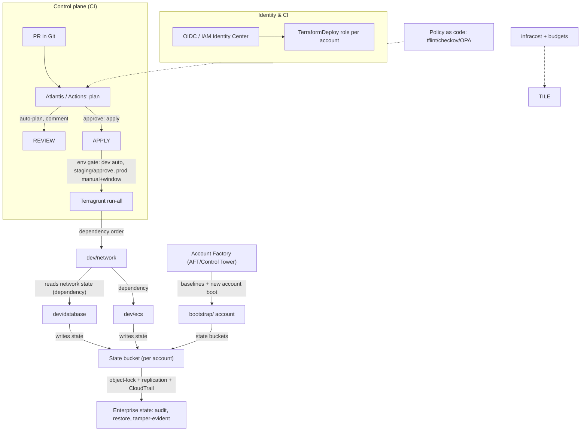

# Terraform Architecture Review — Multi-Account Enterprise Benchmark

**Repo:** `offloadmemory/terraform-101` (Act 1, pure Terraform)
**Date:** 2026-08-23
**Scope:** How well this Terraform *codebase architecture* — directory layout,
state, modules, credentials, execution — would hold up at enterprise scale
when managing a fleet of AWS accounts. This is a benchmark against the
industry-standard patterns of 2026: Terragrunt, Terraform Cloud/Enterprise,
Atlantis, OIDC/IAM Identity Center, Control Tower/AFT, and policy-as-code.
It is **not** a review of the AWS resources themselves (VPC/RDS/ECS are
sensible).

> One crucial framing note: this repo is a **teaching demo whose purpose is to
> surface Terraform's friction**. Several of its "gaps" are deliberate props.
> The critique below separates **intentional pedagogy** (fine for Act 1) from
> **genuine enterprise blockers** (would not survive a real fleet). The
> recommendation is a staged path, not a rewrite.

---

## 1. Executive summary

| | Verdict |
|---|---|
| **Overall** | A clean, honest, well-documented **single-team demo**; a solid foundation for Act 2. As an **enterprise multi-account platform** it is missing the two pillars that separate "runnable on a laptop" from "operated by an org": **identity/pipeline automation** and **versioned governance**. |
| **What's already right** | State isolation per account, S3-native locking, byte-identical environments, no secrets in code, sensible modules, honest gap surfacing. |
| **Biggest blockers** | (1) static-credential identity model, (2) **no CI/CD**, (3) **unversioned local modules** with no promotion control, (4) state coupled across components by hardcoded keys. |
| **Fastest path** | Terragrunt (already planned as Act 2) + an Atlantis/Actions plan-apply loop + OIDC/SSO instead of static keys. |

**Bottom line:** as a *demo* this is genuinely good. As a *platform* it would
need roughly the roadmap in §7 — 3 phases, none of which require throwing this
away.

---

## 2. Scorecard

| Dimension | This repo (2026) | Industry standard (enterprise) | Verdict |
|---|---|---|---|
| Directory structure | Environment-centric, thin roots, shared modules | Environment-centric (Terragrunt `live/`+`modules/`) is the norm | ✅ |
| Module reuse | Hand-rolled local modules, `source = "../../"` | Versioned modules from a private registry with `version` constraints | ⚠️ |
| State isolation | Per-account bucket, per-component key | Per-account/centralized state, strict IAM, CloudTrail, object-lock/replication | ✅ |
| State locking | S3-native `use_lockfile` (≥1.11) | S3-native now standard (DynamoDB deprecated) | ✅ |
| Identity & creds | Static `~/.aws/credentials` profiles + static keys | IAM Identity Center / SSO, OIDC for CI, per-account assume-roles, no static keys | ✗ |
| Backend config | Static, hand-written per component | Generated by Terragrunt (`remote_state`), or TFC/Separate managed state | ✗ |
| Cross-component coupling | `terraform_remote_state` with hardcoded keys | Terragrunt `dependency` (typed, auto-wired), or SSM/registry outputs | ⚠️ |
| Orchestration | Manual sequential applies; Makefile loops | CI pipeline per workspace: plan in PR, gated apply (Atlantis / Actions / TFC) | ✗ |
| Module versioning | None — one copy, no pins per env | Versioned module releases; each env can pin its own | ✗ |
| Policy / linting | None | tflint + checkov/tfsec + terraform-docs in pre-commit; OPA/Sentinel at plan | ✗ |
| Testing | `validate` only | `terraform test`, plan-diff review, post-apply smoke | ⚠️ |
| Drift detection | None | Drift runs, scheduled plans, notifications | ✗ |
| Account baseline | Only state buckets | Control Tower + Account Factory (AFT) or baseline modules (CloudTrail, Config, GuardDuty) | ✗ |
| Multi-region | Hardcoded `us-east-1` everywhere | Region as a first-class variable; per-region state | ⚠️ |
| Secrets | RDS managed password, no secrets in code | Managed secrets + `sensitive` outputs everywhere | ✅ |
| Cost & budgets | None | `infracost` in CI, budgets, tagging for allocation | ⚠️ |

---

## 3. What is already right (be specific)

1. **Per-account, per-component state.** `tfstate-<env>` bucket + `<component>/terraform.tfstate` gives a sane blast radius: one component, one account can be changed without a whole-environment diff. This is the foundation every enterprise pattern keeps.
2. **S3-native locking, no DynamoDB.** You've already moved to `use_lockfile` (GA since 1.11) — the current best practice. Good catch earlier.
3. **Byte-identical environment roots.** `main.tf/variables.tf/outputs.tf/versions.tf` identical across dev/staging/prod, with only `backend.tf` + tfvars differing. This is exactly the "copy the folder, change the values" promotion story, and it's the shape Terragrunt automates — so Act 2 is a mechanical translation, not a rewrite.
4. **No secrets, managed DB password.** `manage_master_user_password` and no literal password anywhere is enterprise-grade hygiene.
5. **Modules at repo root.** Sharing modules across both acts is the right call; the module boundaries (network/database/ecs/state) are the standard decomposition.
6. **Honest demo.** The repo's own `docs/GAPS.md` names the friction it creates. That self-awareness is exactly what makes this a *good teaching* artifact.

---

## 4. The gaps — ranked by how much they hurt at enterprise scale

### P0 — Blockers (would stop you on day one of a real multi-account org)

**1. Identity model: static long-lived access keys.**
Every workspace authenticates with a named profile backed by static `aws_access_key_id` in `~/.aws/credentials`. Enterprises treat that as a security incident: keys leak (`.tfvars`/`~/.aws` ends up in logs/CI/history), they never rotate, and they don't audit. The standard today is:
- **IAM Identity Center / SSO** for humans,
- **OIDC / GitHub Actions role-chaining** for CI (no secrets at all),
- per-account IAM roles (`arn:aws:iam::ACCOUNT:role/terraform-deployer`) assumed from a single management identity, with `role_arn` + `source_profile` or pure OIDC.
- Even keeping the demo structure: profiles should be SSO profiles, not access keys.

**2. No CI/CD. The only way to run this today is a laptop with credentials.**
- Every plan/apply is manual; there's no audit trail, no one can review a plan before it applies, and no one can push to `prod` safely. Enterprise minimum:
- **Atlantis** (plan/apply inside PRs, per-project state, locking, audit) or
- **GitHub Actions / GitLab CI** generating plan diffs on PRs, with `apply` gated by environment and by **manual approval for `prod`**.
- `make validate` is a good gate but it's the *local* gate; it needs to be a *pipeline*.

**3. Cross-module coupling by hardcoded keys — no versioning of the "contract".**
- `data "terraform_remote_state"` with `key = "network/terraform.tfstate"` reads whatever is *currently* in the bucket. There is no versioning of the network state: if `network` is ever changed or re-created, database and ecs break, silently, at the next apply. `terraform_remote_state` is widely considered an anti-pattern in enterprise for exactly this reason.
- The industry cure is **dependency management**: Terragrunt's `dependency` (which reads a state but with typed, explicit inputs), **TFC** orchestration, or **publishing outputs to a key-value service (SSM/Parameter Store)** with versioning.
- (For the demo this is a *deliberate* teaching gap — the "brittle coupling" beat. At scale it's a genuine hazard.)

**4. Unversioned, unpinned modules.**
- `modules/` are local (`source = "../../"`). No `version` constraint exists because there's no registry. Consequences:
  - A change to `modules/ecs` ships to **all three environments at once** — you cannot promote a tested version to `prod` independently of `dev`.
  - There's no changelog/diff visibility for consumers; no semantic versioning.
- Enterprise standard: publish modules to a **private registry** (GitHub Enterprise + `terraform registry` helper, Terraform Cloud private registry, or a versioned S3 registry) and constrain with `version = "~> 1.2"`. Then `dev` can run 1.3 while `prod` stays on 1.1 until you approve the promotion.

### P1 — Serious gaps (must have before a fleet, even with Terragrunt)

**5. No policy-as-code / static analysis.**
- Nothing runs `tflint`, `tfsec`/`checkov`, `terraform-docs`, or `infracost`. A `nat_gateway_count` validation block is the only guardrail. Enterprises gate the module registry with:
  - `pre-commit` hooks (fmt, lint, docs, security scan),
  - **OPA/Sentinel** policies at the *plan* level (e.g., deny public SG, require encryption, require tags),
  - provider-level defaults in org settings.
- This is cheap to add and multiplies safety across every workspace.

**6. Account baseline is only the state bucket.**
- `bootstrap/` creates state infra but nothing else per account. In a real multi-account org, every account needs CloudTrail, Config, GuardDuty, default EBS encryption, a Security group baseline, IAM role base, SCP-guarded boundaries, and a *named account pattern* (the account ID + OUs). The de-facto standard is **AWS Control Tower + Account Factory for Terraform (AFT)**, or at minimum an `account-baseline` Terraform module applied to every new account. Without this, each new AWS account you create starts "bare and ungoverned".

**7. The static `backend.tf` doesn't scale.**
- Nine hand-written backend blocks, each with the bucket/key/region/profile in four-line duplication. This is the repo's own "gap #2" — and at scale, it's not a `demo gap`, it's the main reason orgs reach for Terragrunt. Hand-edited backends for 30 accounts × 15 components is unmaintainable (drift, typo'd keys, mis-targeted buckets). The cure (Terragrunt `remote_state` / TFC) is the same cures you've already labeled for Act 2.

### P2 — Hygiene (do in a pass, not urgent)

**8. Region is hardcoded `us-east-1`** in provider, backend, tfvars, and remote_state. Multi-region is a first-class requirement in most enterprises; parameterize.

**9. `terraform_remote_state` and outputs aren't `sensitive`.** Outputs like `db_endpoint`/`db_port` are `sensitive`? They aren't. `sensitive = true` on any output that leaks any endpoint/secret ARN is cheap hygiene.

**10. No testing beyond `validate`.** Modules are hand-rolled but have no `terraform test`/test fixtures, no smoke after apply (e.g., curl the ALB DNS after `ecs` applies), no upgrade path for the `engine_version`/`instance_class` pins in `modules/database` (hardcoded 16.4 etc.).

**11. No cost governance.** No `infracost`, no budgets, no tagging-based chargeback (tags exist — good baseline). NAT gateways per account are the biggest single cost line; with real fleets you'd move to a shared NAT/Transit Gateway or shared-VPC model.

**12. Lock-file churn under versioning.** With S3 versioning on, every lock acquire/release leaves a `.tflock` version. Cheap, but worth knowing (a lifecycle rule on the bucket can purge).

---

## 5. Benchmark vs the four enterprise reference patterns

| Pattern | What it gives you | This repo today | Gap |
|---|---|---|---|
| **Terragrunt** (Act 2) | `include`, `generate` for backend.tf, `dependency` for typed state, `run-all` for orchestration, env/account context | Not implemented (planned) | Boilerplate + coupling + orchestration |
| **Terraform Cloud / Enterprise** | Remote runs, policy-as-code (Sentinel), private registry, drift, audit, run ordering | Not used | Everything in the "remote-plane" |
| **Atlantis** | PR-driven plan/apply with review, per-project locks, audit | Not present | CI/CD + review |
| **OIDC / IAM Identity Center** | No static keys, assume-role per account | Static profiles | Identity |

The strongest combination in 2026 for a self-hosted, HashiCorp-native shop is:
**Terragrunt for layout** + **Atlantis (or Actions) for the loop** + **OIDC for
identity** + **pre-commit (tflint/checkov/tfsec/terraform-docs)** + **a
module registry** for pins. TFC/E replaces some of those with managed services
if you accept HashiCorp's platform. OpenTofu is a drop-in alternative if you
want license-neutral Terraform — this repo's HCL is largely portable (the
managed-password / S3-lock features have OpenTofu equivalents).

---

## 5. The enterprise target architecture

### The promotion discipline
The crucial mechanism missing today: **promotion without a single shared clock**.
Today `dev`, `staging`, `prod` share one module codebase — a module change is
promoted to `prod` the moment you `apply` `dev`. Enterprise needs **pins**:

| | Today | Enterprise target |
|---|---|---|
| `dev` | `modules/ecs @ HEAD` | `modules/ecs @ v1.3.0` |
| `staging` | `modules/ecs @ HEAD` | `modules/ecs @ v1.2.0` |
| `prod` | `modules/ecs @ HEAD` | `modules/ecs @ v1.1.0` (approved, then bump) |

Versioned modules are the single highest-leverage change after CI/CD.

---

## 7. Recommended roadmap (in order of ROI)

**Phase 0 — keep the demo as-is.** It teaches the gaps honestly. Nothing here
is wrong *for its purpose*.

**Phase 1 — Identity + CI/CD (the two pillars).**
1. Replace static keys with **OIDC/IAM Identity Center**; assume per-account roles.
2. Add a pipeline that runs `fmt`, `validate`, `tflint`, `checkov`, `terraform-docs` on every PR (this file's `make validate` logic, relocated).
3. Add **Atlantis or Actions** per workspace: `plan` in the PR, `apply` on merge/approval, **manual approval for prod**.
4. Start a **drift** (scheduled plan/diff, or `run-all` plan).

**Phase 2 — Act 2: Terragrunt (your existing plan).**
5. Introduce `terragrunt.hcl` per component (`include` + `generate` + `remote_state`).
6. Replace `data "terraform_remote_state"` with `dependency` blocks.
7. Fold `backend.tf` and the tfvars convention into generated config; delete the 9 hand-written copies.
8. Add `run-all` for env/component fan-out.

**Phase 3 — Governance + versioning + accounts.**
9. Publish modules to a private registry; add `version` pins (the promotion table above).
10. Add `account-baseline` module / Control Tower or AFT for new accounts.
11. Add policy-as-code (Sentinel/OPA) at plan time; make `infracost` a gate.
12. Multi-region: parameterize `region`, split state buckets per region.

---

## 7. What I would NOT do

- **Not use Terraform workspaces for environments.** One workspace per env is right; multi-component blob workspaces give you no blast-radius.
- **Not rewrite the demo structure.** The env-centric layout is the industry norm; Terragrunt is the incremental layer, not a replacement.
- **Not skip S3-native locking** — you're already on the current standard.

---

## 8. Conclusion

This repo is a **very good Act 1**: honest, clean, state-isolated, no secrets,
S3-native. The gaps that would bite an enterprise are **not in the AWS
resources** — they're in the **operating model**: identity, automation,
versioning, policy. None of them require throwing away the structure; each is
a layering step on the exact architecture you have, and two of them (Act 2
Terragrunt, CI/CD) are already on the design's own roadmap.

> **Verdict:** 8/10 for the demo's own purpose; 4/10 for out-of-the-box
> enterprise readiness — with the good news that the 6 points to close are
> well-understood industry-standard patterns, all additions, none rewrites.
