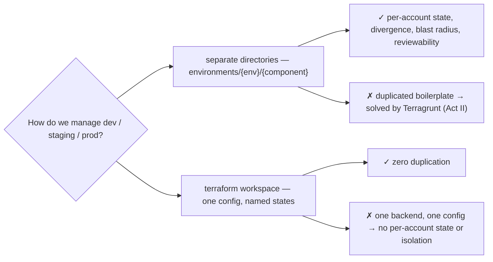
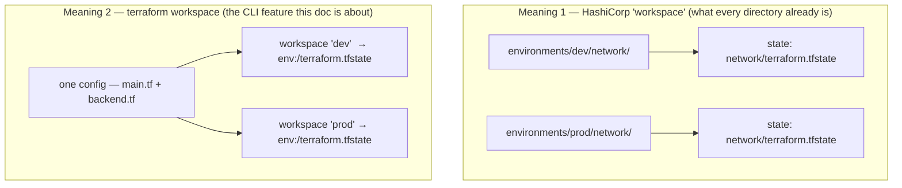
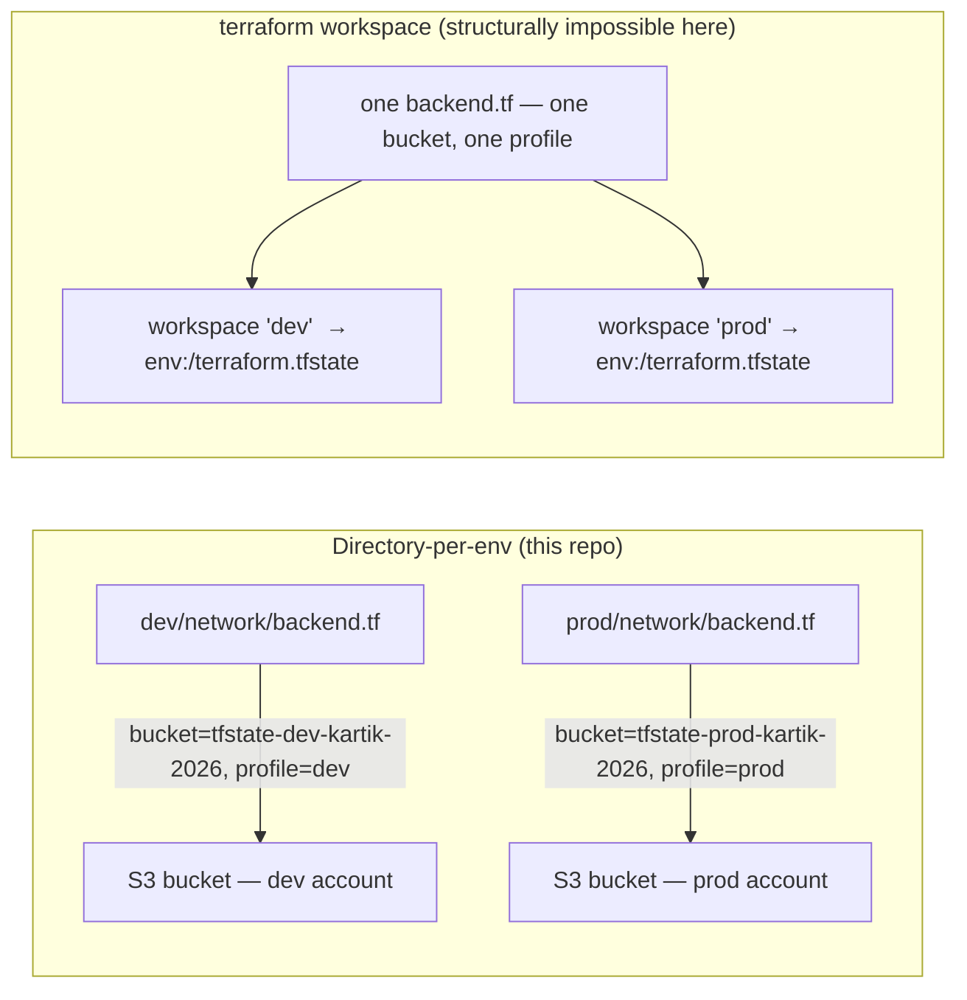
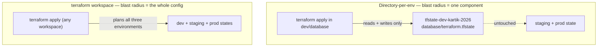
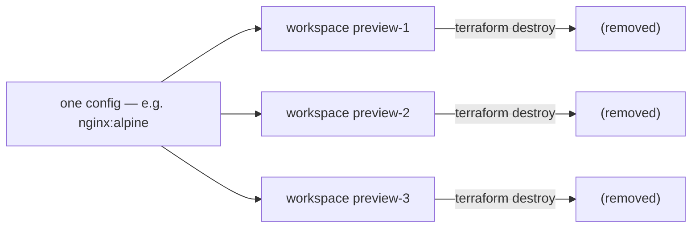
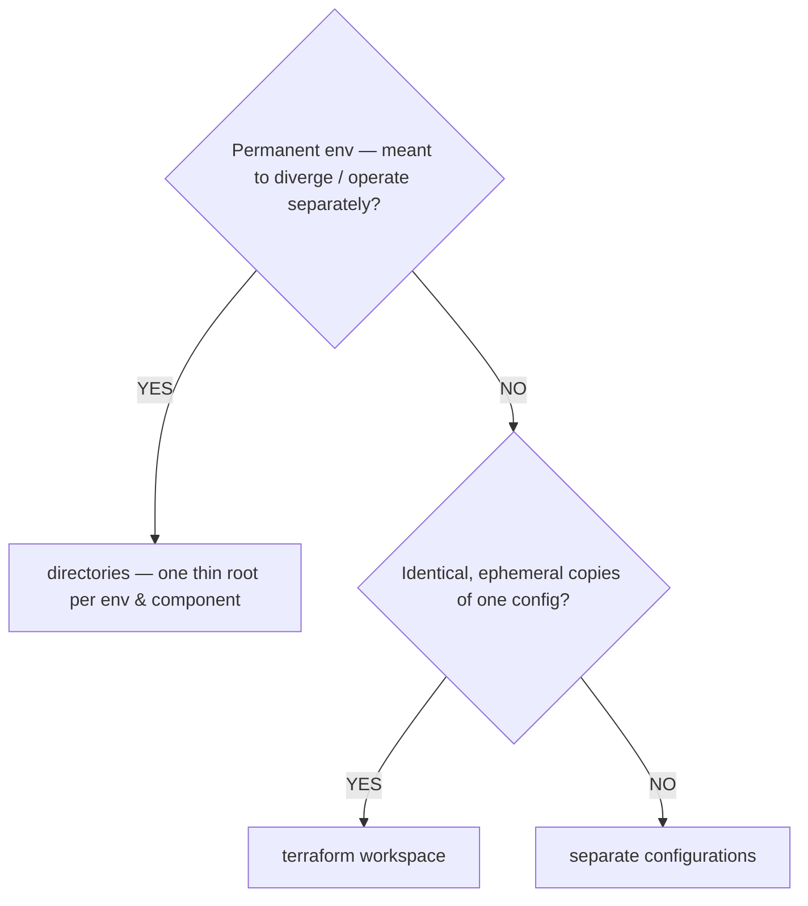
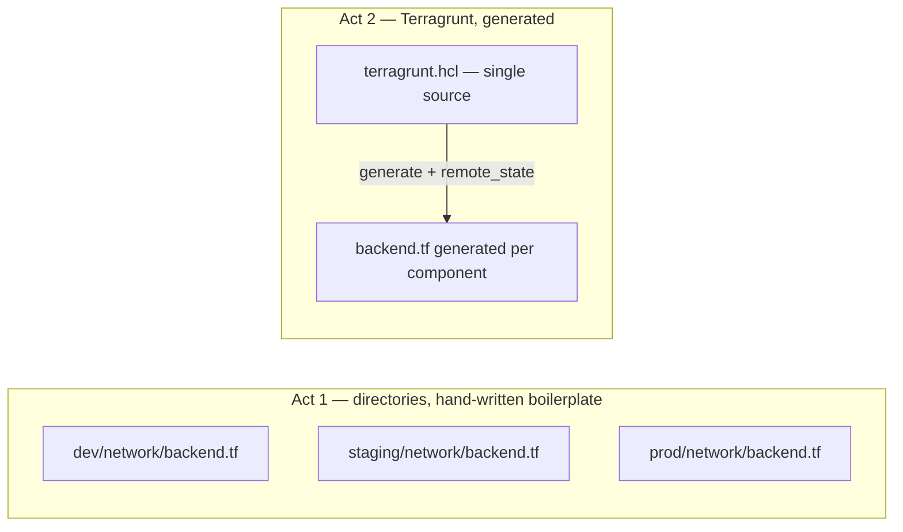

# Environment Strategy — Directory-per-Environment vs. Terraform Workspaces

**Date:** 2026-08-24
**Repo:** `offloadmemory/terraform-101`
**Question:** Why does this repo manage dev/staging/prod as **separate directories**
under `environments/` instead of leveraging **Terraform workspaces**
(`terraform workspace`)? What are the shortcomings, pros, and cons of each?

**Short answer:** environments here are separate **accounts** (separate S3
state buckets, separate IAM profiles), and each must be able to **diverge, be
reviewed, and be destroyed independently**. Terraform CLI workspaces give you
many named state files inside a *single* backend and *single* configuration —
they structurally cannot model per-account backends, and they force every
environment to share one config, which is exactly where environment management
breaks down. Directories are the industry-standard primitive for permanent
environments; workspaces are the right tool for transient, identical copies of
one config.

**Overview — the two candidate models:**



---

## 1. First, disambiguate "workspace"

The term is overloaded in Terraform, which is the root of most confusion:

| Meaning | This repo's usage |
|---|---|
| **HashiCorp "workspace"** = one root configuration + one state file + its vars (the HCP Terraform model). | **Already the case here.** Every leaf — `environments/dev/network`, `environments/prod/ecs`, … — is itself a workspace. One directory = one workspace = one state (see `ARCHITECTURE.md`). |
| **`terraform workspace` (the CLI feature, formerly "environments")** = several named state files within one root module, one backend, one set of `.tf` files. | **Not used for env separation** — the subject of this document. |

When someone asks "why not use workspaces for environments?", they mean the
CLI feature: `terraform workspace new dev|staging|prod`.

**The two meanings side by side:**



---

## 2. The decisive reason: this repo is multi-account

CLI workspaces live **inside one backend**. Every environment here points at a
**different S3 bucket** and a different AWS profile:

```
environments/dev/network/backend.tf     → bucket tfstate-dev-kartik-2026,     profile dev
environments/prod/network/backend.tf    → bucket tfstate-prod-kartik-2026,    profile prod
```

**The core contrast — separate backends vs. workspaces inside one backend:**



Workspaces cannot express that. The backend (bucket + profile) is fixed per
root module — you cannot have workspace `dev` write to bucket A and workspace
`prod` write to bucket B. The moment environments are separate accounts (or
even separate state buckets), directory-per-env is the only native way to give
each its own bucket, profile, and lock.

This is HashiCorp's own guidance — "use a directory for each environment so
that each one has a separate state file" (`RESEARCH.md` §2.1).

---

## 3. Why directories even for single-account environments

| Concern | Directory per env | `terraform workspace` |
|---|---|---|
| **Divergence** | Environments *can* differ — dev skips Multi-AZ, prod enforces deletion protection. Each env is a thin root that can evolve independently. | All envs share **one** config. Any difference becomes `count = var.workspace == "prod" ? 1 : 0` conditionals until the config is an unreadable tangle. |
| **Blast radius** | An apply touches one component of one env. `dev/database` can be destroyed alone, without staging/prod even being read. | One plan/apply evaluates **all envs together**. A bad change to dev is staged against prod in the same run; a single wrong `terraform destroy` in the wrong workspace is catastrophic and easy. |
| **Reviewability** | Env changes are git diffs — "bump prod's instance type" is a PR you can see and approve. | Workspace state lives in the backend, **invisible to git**. Reviewers cannot see "what changed in prod" because prod isn't a directory. |
| **Permissions / CI gates** | Separate profiles + separate backends → dev applies freely, prod requires approval. The enterprise operating model. | One root, one provider block — separating "dev may apply, prod needs sign-off" is coarse and awkward. |
| **Cross-component coupling** | `terraform_remote_state` reads a known bucket+key per env. Deterministic and addressable. | All envs resolve the same data-source graph through one config; coupling gets tangled. |
| **Duplication** | ✗ **The real cost** — 9 near-identical `backend.tf` + `terraform.tfvars` copies. | ✅ Zero duplication — one `backend.tf`, one config to maintain. |

**Blast radius — the strongest argument, in one picture:**



The first five rows are why directory-per-env is the industry standard for
**permanent** environments. The last row is the standard's honest weakness —
and it is solved by Terragrunt (Act II), *not* by workspaces (see §6).

---

## 4. When workspaces *are* the right call

The CLI-workspace feature is not bad — it is **misapplied to permanent
environments**. It is genuinely the right tool when:

- **Environments are transient and identical** — PR preview stacks, per-developer
  sandboxes, blue/green temporary copies. You want "copy this exact config,
  apply, destroy later" without a directory tree.
- **Duplication is the pain you are optimizing** — you would rather maintain one
  `backend.tf` than nine.
- **You are prototyping in a single account** and do not yet need divergence,
  permissions, or review.

That is exactly why HashiCorp's guidance is nuanced: workspaces for
*same-config, many-instances*; directories for *different environments you
intend to keep*.

**Where workspaces shine — identical, ephemeral, disposable:**



---

## 5. Decision rule

**Decision rule as a flow:**



For an enterprise fleet the answer to the first question is almost always
"yes" — which is why the consensus structure (`RESEARCH.md` §1) converges on
`modules/` + `environments/{env}/{component}/`, and why `CRITIQUE.md` §7 says
explicitly:

> **Not use Terraform workspaces for environments.** One workspace per env is
> right; multi-component blob workspaces give you no blast-radius.

---

## 6. The honest counterpoint and the forward path

The directory model's cost is real and acknowledged: **boilerplate repetition**
and **manual promotion of module changes across nine roots**. That is not a
defense of workspaces — it is the *next* step: **Terragrunt**, already the
repo's Act-II plan (`CRITIQUE.md` §7, Phase 2). Terragrunt keeps the
directory/env model *and* removes the duplication by generating `backend.tf`
and tfvars from a single `terragrunt.hcl` tree (`include` + `generate` +
`remote_state`).

**Same directories, boilerplate generated away:**



| Phase | Model | Blast radius | Duplication | Divergence |
|---|---|---|---|---|
| **Act 1 (this repo)** | directories | ✅ per env/component | ✗ 9 copies | ✅ free |
| **Act 2 (Terragrunt)** | directories + generated config | ✅ per env/component | ✅ generated | ✅ free |
| Workspaces | one config, N states | ✗ whole config | ✅ none | ✗ conditionals |

The roadmap is therefore: directories now for isolation, reviewability, and
blast radius — at the cost of duplicated boilerplate; then Terragrunt to
generate the boilerplate away, getting workspaces' DRY-ness **without** giving
up per-env state, divergence, or apply isolation.

---

## Summary

- Environments are separate **accounts / state / permission domains** — each
  must be able to diverge, be reviewed, and be destroyed alone.
- CLI workspaces structurally cannot provide those guarantees (nor, in this
  repo, even different backends).
- Directories are the right primitive for permanent environments; workspaces
  fit transient, identical copies of one config.
- The directory model's one real weakness — duplication — is solved by
  Terragrunt (Act II), not by workspaces.

See also: `RESEARCH.md` (industry benchmark), `CRITIQUE.md` (enterprise
review), `ARCHITECTURE.md` (how environments and state are organised).
